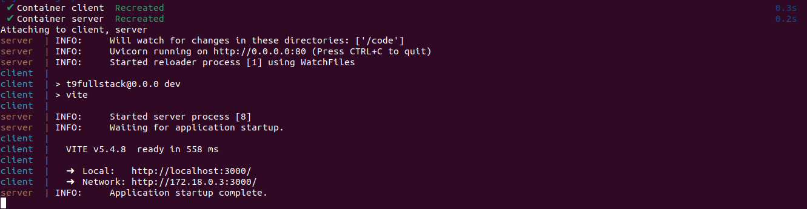
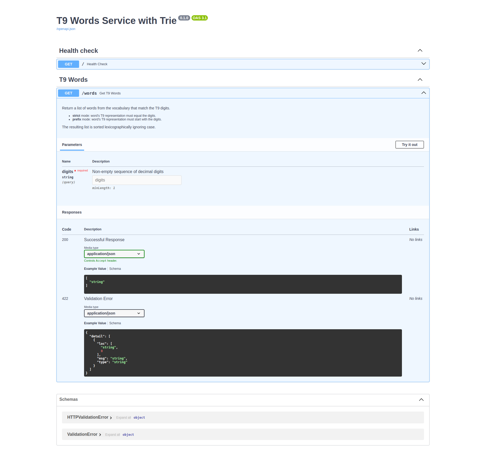
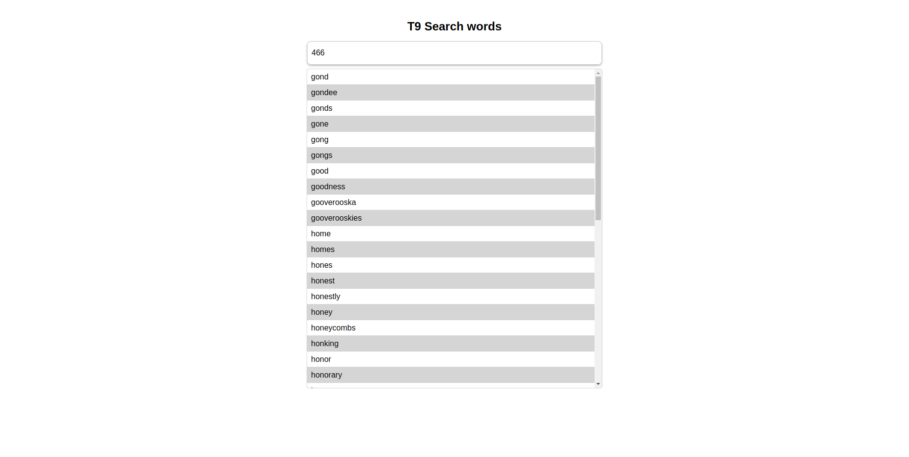
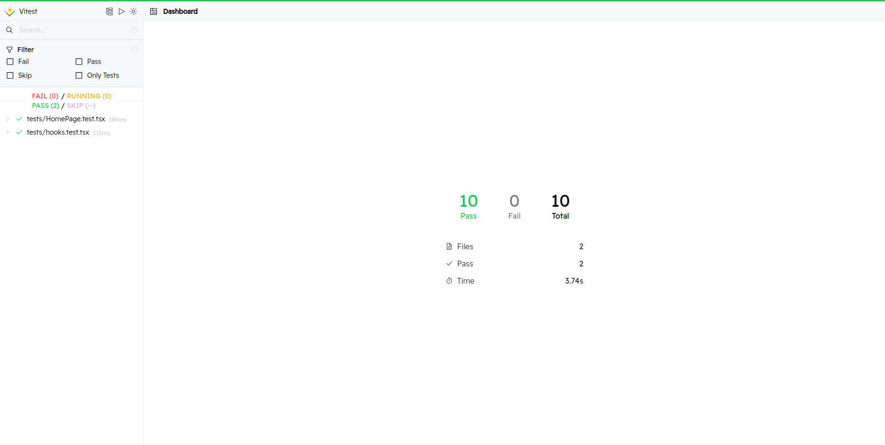

# T9 Webservice with Trie

[](https://opensource.org/licenses/MIT)

A FastAPI-based web service implementing T9 predictive text functionality using a Trie data structure.

## Features

- 🔍 **T9 Predictive Text**: Convert digit sequences to matching words
- ⚡ **High Performance**: Trie-based implementation for efficient prefix searches
- 📡 **REST API**: Fully documented endpoints with Swagger UI
- 🛡️ **Input Validation**: Robust validation for digit sequences
- 🔄 **CORS Support**: Configured for cross-origin requests
- 📦 **Docker Support**: Easy containerization

## Table of Contents

- [How to run](#how-to-run)
- [Tech Stack](#tech-stack)
- [Server overview](#server-overview)
- [Client overview](#client-overview)
- [API Documentation](#api-documentation)
- [Testing](#testing)

## How to run

### Prerequisites

- Docker
- Docker compose

### Steps

- Go to the terminal in your computer
- Got to project root directory which is `t9fullstack`. You'll find docker-compose file there.
- Run the following command

```bash
docker compose up --build
```

If you see the following output on your terminal, that means the containerization was successful and the web service runs successfully.



- Once the images of both `server` and `client` build and containers runs successfully, you can access both server and client application through respective url.

- server url: `http://localhost:8000/docs`
- client url: `http://localhost:3000/`

## Tech Stack

### Server

- **Python**
- **FastAPI** - Web framework for building APIs with python
- **uvicorn** - Web server for network commnication in development env
- **pytest** - Python testing framework (Unit, Integration testing tool)
- **flake8** - Python code linting tool

### Client

- **React**
- **TypeScript**
- **Vite** - Faster and leaner development experience
- **Vitest** - Testing framework
- **React query** - Data fetching and caching
- **axios** - Making HTTP requests
- **Vanilla-extract** - Write stylesheets in TypeScript

## Server verview

The core of the server is Trie data structure. For strict matching where you’re only looking for an exact T9 sequence, I could use a HashMap (mapping T9 codes to lists of words) as it would be very effective in strict matching case.
However, since the service also needs to support prefix matching, the ideal data structure is a **Trie**. A Trie lets you traverse directly to the node corresponding to the prefix and then efficiently collect all words that share that prefix. This avoids scanning through every word and scales much better as the vocabulary grows. Trie data structure is complex compared to HashMap and requires extra memory for stroring nodes and related data, but Trie supports prefix queries and this feature can be used to implement strict queries easily.

Examples:

Example 1: Inserting **"gone"**
After converting "gone" into T9 code, the result is **4663**
The following is the visual representation of the Trie after the insertion of **4663 (gone)**

```bash
(root)
  └── "4" -> g
       └── "6" -> o
            └── "6" -> n
                 └── "3" -> e
                      └── words: ["gone"]
```

Example 2: Inserting **"hoof"**
After converting "hoof" into T9 code, the result is **4663**
The following is the visual representation of the Trie after the insertion of **4663 (hoof)**

```bash
(root)
  └── "4" -> h
       └── "6" -> o
            └── "6" -> o
                 └── "3" -> f
                      └── words: ["gone", "hoof"]
```

Example 3: Inserting **"inoffensive"**
After converting "inoffensive" into T9 code, the result is **46633367483**
The following is the visual representation of the Trie after the insertion of **46633367483 (inoffensive)**

```bash
(root)
  └── "4" -> i
       └── "6" -> n
            └── "6" -> o
                 └── "3" -> f
                      └── words: ["gone", "hoof"]
                      └── "3" -> f
                           └── "3" -> e
                                └── "6" -> n
                                     └── "7" -> s
                                          └── "4" -> i
                                               └── "8" -> v
                                                    └── "3" -> e
                                                         └── words: ["inoffensive"]
```

Example 4: Inserting **"hold"**
After converting "hold" into T9 code, the result is **4653**
The following is the visual representation of the Trie after the insertion of **4653 (hold)**

```bash
              [root]
                │
                4
                │
                6
           ┌────┴──────────────┐
           │                   │
           6 branch            5 branch
           │                   │
           3                   3  <-- "hold" stored here
  (words: "gone", "hoof")
           │
           3  (continuation for "inoffensive")
           │
           3
           │
           6
           │
           7
           │
           4
           │
           8
           │
           3  <-- "inoffensive" stored here

```

Example 5: Searching for prefix of digits **46**

```bash
        [root]
                │
                4
                │
                6
           ┌────┴──────────────┐
           │                   │
           6 branch            5 branch
           │                   │
           3                   3  <-- words collected: ["hold"]
  words collected: ["gone", "hoof"]
           │
           3
           │
           3
           │
           6
           │
           7
           │
           4
           │
           8
           │
           3
  words collected: ["gone", "hoof", "inoffensive"]
```

The search returns the combined list: ["gone", "hoof", "inoffensive", "hold"]
As the final requirement is return the result as lexicographically increasing order, ignoring lower and upper cases, which means sorting strings as if they were in a dictionary, but treating uppercase and lowercase letters as the same. So, the final result from the API would be `["gone", "hold", "hoof", "inoffensive"]`.

### Client overview

The client service is biuld on **React** and **TypeScript** with **Vite**. Vite is a local development server that has TypeScript and JSX support and uses Rollup and esbuild for bundling, these makes it fast frontend build tool as well provides faster development experiences.

Once, you run the application through docker compose, use this url: `http://localhost:3000/`. This url will take you to the front-end of the application.

I have used following libraries for the development.

#### React-query

A JavaScript library designed to simplify the complex task of data fetching and caching in React applications. It offers a set of hooks and utilities that enable you to manage data from various sources, including REST APIs

#### Classnames

A simple javascript utility for conditionally joining classNames together. The classNames function takes any number of arguments which can be a string or object.

#### React-loading-skeleton

A JavaScript library that allows you to create these beautiful, animated loading skeletons. A skeleton screen is an UI that looks similar to the original structure of a page when all of its content is loaded.

#### React testing library

As you create and run react application by adding components, you need a library that provides component level test feature. React testing library is a lightweight solution for testing React component as well as hooks. As my client application has couple of custom hooks and functional components, I choose this library to write test cases.

## API Documentation Demo

I have used FastAPI as it is light and easy to implement and run APIs. Besides, it provides **SwaggerUI** which gives the documentation of the APIs, so user can read and test API without implementing into a front end or using any third party application (e.g. Postman)
For example, if you use this url `http://localhost:8000/docs#/`, you'll see the UI of API in SwaggerUI format.


**N.B. To learn more about the API, please visit the url.**

## Client UI Demo

The client service is built with React and TypeScript along with React Query, Axios, Vanilla extract. Once the application runs successfully, using the client URL, you can see the following UI. The UI has one input field to



## Testing

### Server

#### Pytest

I have added Unit and Integration test cases for the server API and function. To run the tests, please follow the following steps:

- Go to the terminal in your computer
- Run the command:
  `docker exec -it server /bin/sh` (this command will take you to the inside of the server container)
  `cd app`
- Once you are inside of the `app` directory of the server container, run this command in the terminal:
  `pytest`

You'll see the following output in the terminal:

```bash
=============================================================== test session starts ===============================================================
platform linux -- Python 3.10.14, pytest-8.3.4, pluggy-1.5.0 -- /usr/local/bin/python
cachedir: .pytest_cache
rootdir: /code/app
configfile: pytest.ini
testpaths: tests
plugins: anyio-4.8.0
collected 10 items

tests/test_api.py::test_valid_t9_search PASSED                                                                                              [ 10%]
tests/test_api.py::test_strict_matching_api PASSED                                                                                          [ 20%]
tests/test_api.py::test_invalid_digits PASSED                                                                                               [ 30%]
tests/test_api.py::test_empty_digits PASSED                                                                                                 [ 40%]
tests/test_api.py::test_sorting_order_api PASSED                                                                                            [ 50%]
tests/test_t9trie.py::test_strict_matching PASSED                                                                                           [ 60%]
tests/test_t9trie.py::test_prefix_matching PASSED                                                                                           [ 70%]
tests/test_t9trie.py::test_empty_search PASSED                                                                                              [ 80%]
tests/test_t9trie.py::test_invalid_characters_handling PASSED                                                                               [ 90%]
tests/test_t9trie.py::test_sorting_order PASSED
```

### Client

#### Vitest

A Vite-native fast testing framework. Also, **vitest/ui** provides a user interface for testing the front end. To run the client test cases, please follow the following steps:

- Go to the terminal in your computer
- Run the command:
  `docker exec -it client /bin/sh` (this command will take you to the inside of the client container)
- Once you are inside of the `app` directory of the client container, run this command in the terminal:
  `npm run test:ui`
  You'll see the following output in the terminal:

```bash
✓ tests/hooks.test.tsx (5 tests) 115ms
✓ tests/HomePage.test.tsx (5 tests) 189ms

Test Files  2 passed (2)
    Tests  10 passed (10)
  Start at  10:53:31
  Duration  2.22s (transform 679ms, setup 292ms, collect 1.39s, tests 304ms, environment 1.52s, prepare 229ms)
```

As I mentioned earlier that vitest/ui provides a user interface, so you can see the graphical interface of the test cases by going to this url: `http://0.0.0.0:51204/__vitest__/#/`. You'll see the view like this:


